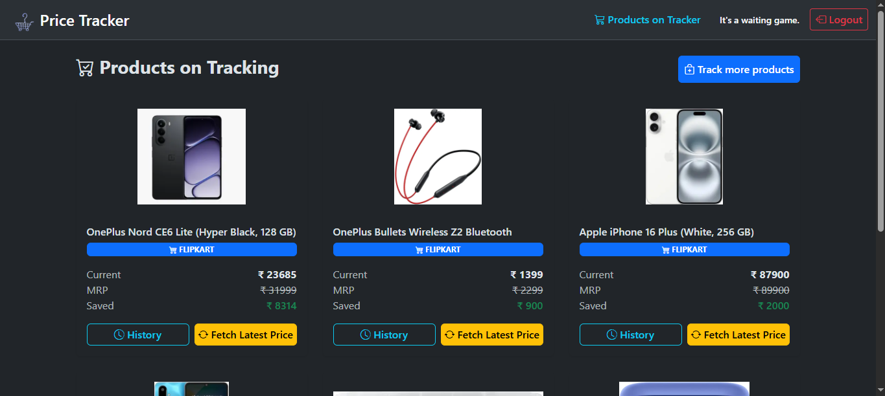
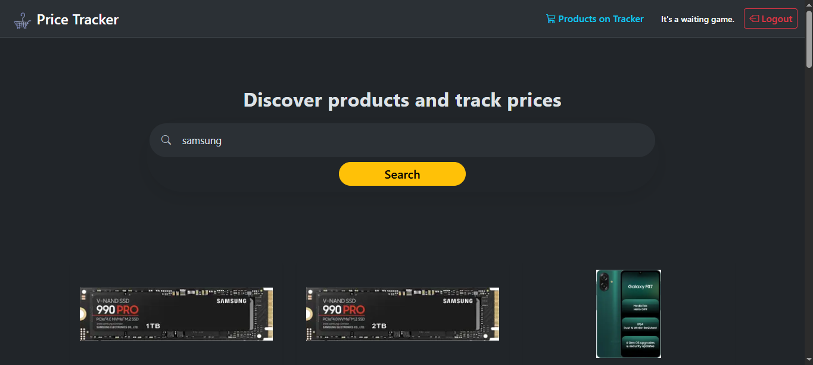
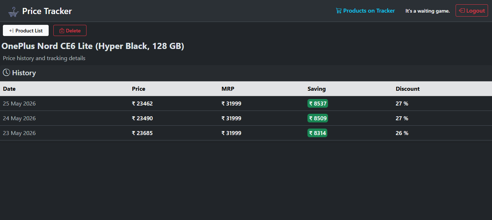

# Price Tracker

A full-stack web application that autonomously monitors Flipkart product prices, delivering instant email notifications when prices drop below user-defined thresholds. Built with enterprise-grade architecture featuring asynchronous task processing, JWT-based authentication, and intelligent scraping strategies.

### Live Demo Here
---
## Screenshots

## Core Features

### User
- **Search & Track :** Real-time product search with image previews
- **Email Alerts :** Automated notifications when prices drop
- **Responsive UI :** Bootstrap design

### Technical
- **Token Auto-Refresh :** Background renewal every 25 minutes
- **Rate Limiting :** Prevents token refresh abuse (10/min)
- **Cascade Deletions :** Automatic cleanup of child records (prices, alerts)

### Security
- **Password Hashing :** pwdlib with Argon2 algorithm
- **JWT Security :** httpOnly cookies (XSS protection) + SameSite=Lax (CSRF mitigation)
- **Token Refresh :** Separate refresh tokens with 7-day expiry

## Tech Stack

### Backend
- **Framework :** FastAPI (async Python web framework)
- **Database :** PostgreSQL + SQLAlchemy ORM + Alembic migrations
- **Authentication :** JWT (python-jose) + pwdlib password hashing
- **Task Queue :** Celery + Redis (broker & backend)
- **Scheduler :** Celery Beat (cron-based periodic tasks)

### Scraping
- **Browser Automation :** Playwright (Chromium headless)
- **HTML Parsing :** BeautifulSoup4

### Frontend
- **Templating :** Jinja2
- **CSS Framework :** Bootstrap 5.3
- **Interactivity :** HTMX 2

### Devops
- **Containerization :** Docker + Docker Compose
- **Rate Limiting :** SlowAPI (10 req/min on refresh token)
- **Email :** SMTP (Gmail integration)

## Layout
    price-tracker/
    ├── app/
    │   ├── main.py              # FastAPI app endpoints
    │   ├── config.py            # env variable validation
    │   ├── database.py          # DB sessions
    │   ├── db_models.py         # all SQLAlchemy DB models
    │   ├── schemas.py           # all Pydantic schemas
    │   ├── crud.py              # DB operation logics
    │   ├── auth.py              # user authorisations (login, logout, register, refresh) & JWT logic
    │   ├── scraper.py           # scraping operations BS4 & Playwright logic
    │   ├── tasks.py             # Celery scheduled task operations
    │   └── notify.py            # email alert logic
    │
    ├── templates/               # Frontend
    │   ├── authorization
    │   │   ├── login.html
    │   │   └── register.html
    │   ├── others/
    │   │   └── search_api.html
    │   ├── user_dashboard/
    │   │   ├── homepage.html
    │   │   └── product.html
    │   ├── base.html
    │   └── search.html
    │
    ├── static/
    │   ├── css/style.css
    │   └── images/              # image materials
    │
    ├── tests/
    │   ├── Work in Progress
    │   └── 
    │
    ├── docker-compose.yml
    ├── dockerfile
    ├── README.md
    └── requirement.txt